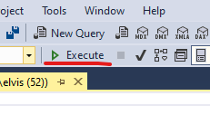
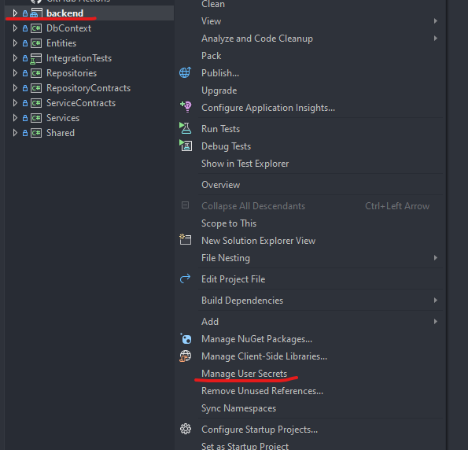
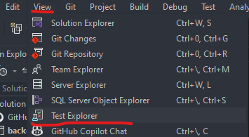
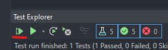
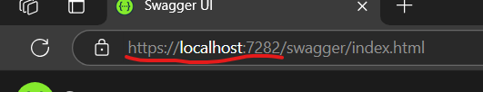
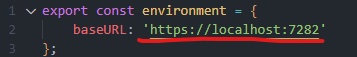

# Setup configuration to run To-Do List Project locally

### Creating the database from the script file

1. Go to the project folder > Database Scripts.
2. Open the Db_Scripts file. Make sure it is opened in SQL Server Management Studio.
3. After opening the file, click Execute to create the database, the table and insert the data in the table.



### Configuring connection string in .NET Web API

1. Open your Visual Studio and go to the Solution Explorer.
2. Right-click on "backend" which is the Web API project and click "Manage User Secrets".



3. Copy the code below and paste the connection string inside the curly braces and add your database local server name.
```
"ConnectionStrings": {
  "TodoListConnection": "Server={Your database server name};Database=TodoList;Integrated Security=True;TrustServerCertificate=True"
}
```
4. Run your API project. It should take you to the Swagger page where you can test the endpoints.
5. Try some endpoints to check the functionality of the backend.

### Configure the test project for Integration Testing

1. In the Solution Explorer, go to IntegrationTests project, then right-click, then "Manage User Secrets"
2. Copy and paste the connection string below. This time, you can set the name you want for the test database, except the database name of the application. Do NOT add the database name of the application, since this tests will affect the database being tested.
```
"ConnectionStrings": {
  "TodoListConnection": "Server={Your database server name};Database={Your test database name};Integrated Security=True;TrustServerCertificate=True"
}
```
3. To run the tests, on the top menu, go to View > Test Explorer



4. Click on the arrow on the left side of the Test Explorer window to run all the tests to check if everything works.



### Configure the Angular project to connect with the Web API project

1. Run you API project and, after it opens Swagger in your browser, copy the base url in the route of the web page.



2. Open your Angular project.
3. Go to src > environments > environment.development.ts.
4. Paste and replace the base url.



5. Run your Angular application with the command `ng serve -o` in the terminal inside the Angular project folder, and now you can test the To-Do List project. Make sure your API project is running as well.
6. To run the tests in Angular, use the command `ng test` in the terminal.
